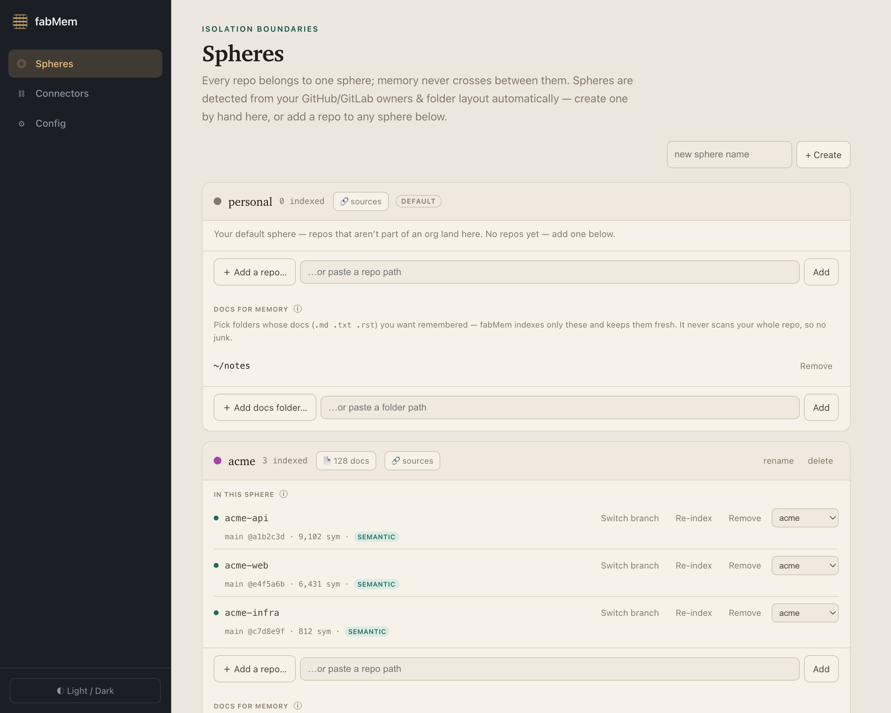
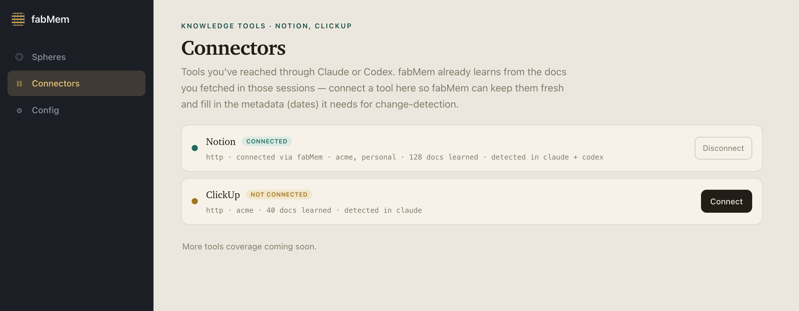
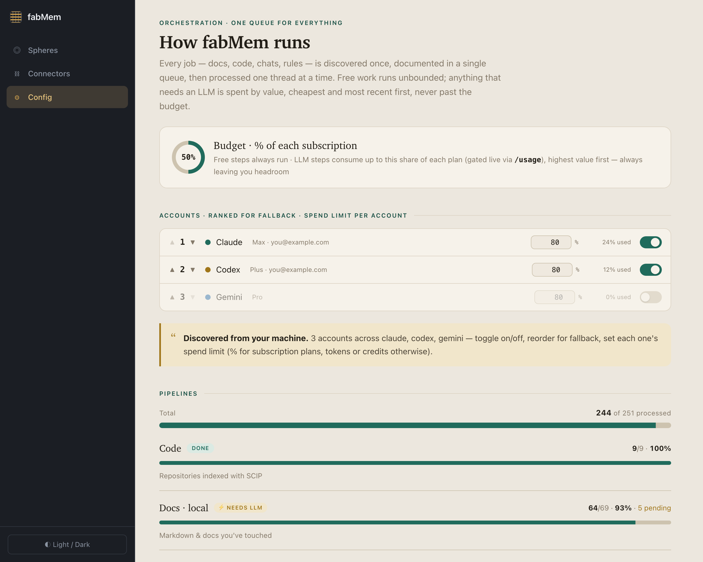

# fabMem

**Complete context for you and your agents.** fabMem is a local-first memory and code-intelligence engine. It unifies your code, docs, tickets, decisions, and past AI sessions into one graph on your machine — and serves it to the AI coding tools you already use, over MCP.

> Ask once. fabMem checks everything — your code, Notion, ClickUp, Jira, and your Claude / Codex / Cursor sessions — then answers with where each part came from.

## Why fabMem

- **Automatic** — set it up once, then forget it. It reads your AI sessions (Claude Code, Codex, Cursor…), installs its own hooks + MCP into every agent you use, indexes your code with zero config, and injects only the CLAUDE.md rules a tool is missing.
- **Private** — never leaves your machine. A local Postgres with no network port, on-device embeddings, detect-first access. Zero bytes of your code go out.
- **Portable** — any agent, no lock-in. One MCP server every agent plugs into; leave any tool and your memory stays.
- **Grounded** — answers from your real project, with receipts. A real code index (SCIP) across 10+ languages, and a temporal graph that supersedes old decisions instead of leaving them to contradict.

## Install

```bash
npm install -g fabmem
fabmem setup
```

Or run it without installing:

```bash
npx fabmem setup
```

`setup` builds your first index, walks you through connecting your tools, and opens the dashboard.

## Three steps

1. **Install fabMem** — `npx fabmem setup`. It builds your first index and starts running in the background.
2. **Connect your tools** — approve MCP connectors for Notion, ClickUp and more, so your docs and tickets come in alongside your code.
3. **Open the dashboard** — manage your project spheres, and choose which AI harnesses (Claude Code, Codex, Cursor) use fabMem.

> [!IMPORTANT]
> **Your memory space (sphere) is derived from your current folder.** Run your agent — and any `fabmem` command — from **inside the relevant repo**, so it reads and writes that project's memory. Launching from an unrelated folder (like your home directory) points at the wrong space.

## Dashboard

`fabmem dashboard` opens a local dashboard (on your machine) with three tabs.

**Spheres** — per-project memory isolation; see each space's indexed repos (with symbol counts) and docs.



**Connectors** — connect MCP tools like Notion and ClickUp, or see the ones detected from your AI sessions.



**Config** — choose which AI accounts fabMem uses (ranked for fallback), set a budget and per-account spend limits, and watch the ingestion pipelines.



## What gets installed

The npm package is small — the compiled `fabmem` CLI + engine, no source. Everything heavy is provisioned **locally, on first run, under `~/.fabmem/`** — nothing leaves your machine:

- **An embedded PostgreSQL 17** — your local memory store. No system Postgres required and **no network port** is opened (it listens on a private socket).
- **pgvector** — the vector extension for semantic search, fetched as a prebuilt binary for your platform.
- **A local embedding model** (BGE-small) — runs on your CPU; your text is never sent to a cloud to be embedded.
- **Code indexers (SCIP)** — installed per language the first time you index (TypeScript, Python, Go, Rust, C++, C#, Java, and more).
- **MCP wiring + hooks** — `setup` registers fabMem's MCP server into the AI agents you already have (Claude Code, Codex, Cursor, Gemini) and adds Claude's session-memory hook.

It's all self-contained under `~/.fabmem/` and simple to remove — just delete that folder.

## Commands

You only need four:

| Command | What it does |
|---|---|
| `npm install -g fabmem` | Install the CLI (or skip it and use `npx fabmem …`) |
| `fabmem setup` | Guided first-run — provisions everything above, connects your tools, opens the dashboard |
| `fabmem doctor` | Health check — confirms an AI account is connected and the local pieces are working |
| `fabmem dashboard` | Open the dashboard to manage spheres, connectors, and which agents use fabMem |

## Works with

Claude Code · Codex · Cursor · Gemini · Copilot — over MCP. Connectors: Notion, ClickUp, Jira, and other MCP sources.

## How it compares

Legend: ✅ yes · ⚠️ partial / limited · ❌ no

| | fabMem | mem0 | Zep/Graphiti | Pieces | Cursor | Cody (Sourcegraph) | Letta/MemGPT | claude-mem |
|---|---|---|---|---|---|---|---|---|
| Local-first & private (code never leaves) | ✅ | ⚠️ self-host | ⚠️ self-host | ✅ | ❌ cloud | ❌ hosted | ⚠️ self-host | ✅ local files |
| Real code intelligence (SCIP defs/refs) | ✅ | ❌ | ❌ | ❌ | ⚠️ embeddings | ✅ SCIP | ❌ | ❌ |
| Unifies code + docs + tickets + AI sessions | ✅ | ❌ | ❌ | ⚠️ | ⚠️ code+docs | ⚠️ code | ❌ | ❌ |
| Temporal graph (old decisions superseded) | ✅ | ⚠️ | ✅ | ❌ | ❌ | ❌ | ❌ | ❌ |
| Reads your AI-harness sessions (Claude/Codex/Cursor/Gemini) | ✅ | ❌ | ❌ | ⚠️ | ❌ own only | ❌ | ❌ | ⚠️ Claude only |
| Any agent, no lock-in (open MCP) | ✅ | ⚠️ SDK/MCP | ⚠️ SDK/MCP | ⚠️ MCP | ❌ IDE | ❌ IDE | ⚠️ framework | ❌ Claude only |
| Auto-indexes (zero curation) | ✅ | ❌ write via API | ❌ write via API | ⚠️ | ✅ open repo | ✅ repos | ❌ | ⚠️ sessions |
| Cited answers (source-grounded) | ✅ | ⚠️ | ⚠️ | ⚠️ | ✅ | ✅ | ❌ | ❌ |
| **Ease of install** | one command (`npm i -g`) | SDK + vector store | SDK + Neo4j / cloud | desktop app | install IDE | IDE ext + account | server (pip/docker) | plugin |
| **Ease of use** | zero-config, runs itself | integrate via code | integrate via code | background app + GUI | in-IDE | in-IDE | build an agent | auto (Claude only) |
| Price | free · paid cloud coming soon | OSS free / paid cloud | Graphiti OSS / Zep paid | free tier | free + Pro | free + enterprise | OSS / paid cloud | free |

<sub>Comparison based on public information as of mid-2026; corrections welcome. MemGPT is now Letta (same project).</sub>

## Code intelligence & languages

fabMem builds a **real, compiler-grade code index (SCIP)** — true definitions and references, not fuzzy embedding guesses.

- **Full SCIP indexing:** TypeScript / JavaScript · Python · Go · Rust · Ruby · C# · C / C++ · Java · Scala · Kotlin
- **Syntactic (best-effort):** PHP — no SCIP indexer exists for it yet, so it's resolved without a build (toolchain-free / tree-sitter)

**How it indexes — the cascade.** For a SCIP language, fabMem gets a *real* index by trying, in order:

1. **Local build (default)** — auto-detects your toolchain and indexes with your exact environment (reusing your dependencies; reading the repo to pick the right JDK / .NET SDK / etc.). Fast, and matches how your project actually builds.
2. **Container fallback** — if the host can't (a missing toolchain or an OS-level limit), it spins up a container to index there instead. A few languages go container-first by default — **C#, Scala, Kotlin** (host toolchains deadlock or usually aren't installed). Force containers for everything with `FABRIC_SCIP_DOCKER=1`.
3. **Never silently degraded** — for a SCIP language, SCIP is *authoritative*. If it genuinely can't index (no toolchain **and** no Docker), fabMem surfaces that as an issue rather than quietly dropping to a fuzzy or syntactic index.

Indexers self-provision on first use (into `~/.fabmem/`), so there's nothing to install by hand. Docker is only needed for the container fallback.

## Best practices

Get the most out of fabMem:

- **Sign into one agent.** fabMem's synthesis and session memory run on an account you already have (Claude Code / Codex / Gemini). `fabmem doctor` confirms it's connected.
- **Let it run.** It indexes your code and harvests your AI sessions in the background — the more you work, the sharper its memory. Don't babysit it.
- **Connect your sources.** Add Notion / ClickUp / Jira from the dashboard so answers span docs and tickets, not just code.
- **Always work from the repo folder.** Your sphere is derived from the current directory — run your agent and `fabmem` from inside the project so you get that project's memory, not another's.
- **Keep projects in separate spheres.** Each project is its own space; keeping unrelated repos apart makes answers cleaner and more relevant.
- **Put your conventions in CLAUDE.md.** fabMem reads your rules and injects only the ones a given tool is missing.
- **Just ask your agent.** Once wired over MCP, ask normally — your agent queries fabMem and answers with citations. No new UI to learn.
- **Build your project once locally.** If your repo already compiles on your machine, fabMem indexes straight from your existing build — no toolchain to provision and no container fallback needed. It's the fastest, most accurate path, so do this first.
- **Install Docker as a safety net.** For a language you don't build locally (or C# / Scala / Kotlin), Docker lets fabMem index it via the container fallback.
- **Stay current.** Node 20+; fabMem nudges you when a new version ships (`npm i -g fabmem`).

## Privacy

fabMem is local-first. Your code, docs, and history are indexed into an embedded Postgres on your own machine — nothing is collected or sent to us. When you use an AI agent or model through fabMem, requests go to the providers you have configured, under their own policies.

## Requirements

- Node.js 20 or newer
- macOS or Linux (Windows support in progress)

## License

Proprietary — all rights reserved. See [LICENSE](LICENSE). fabMem is distributed as a compiled package; no source is included.
